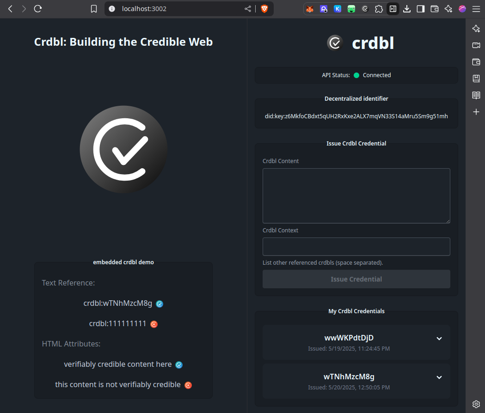

# crdbl

**crdbl**, powered by cheqd, provides trust infrastructure for a more credible web by transforming any human- or AI-generated content into a "crdbl"; a verifiable credential anchored to a decentralized identifier. When other crdbls are supplied as context, an AI engine recursively checks each new claim against the context, ensuring only credible credentials are issued thus weaving a composable, cryptographically linked graph of provenance where every assertion can be traced, proven, and marked as verifiably credible.

A browser extension lets users mint, reference, and view verification status in-page, while an API offers AI agents programmatic issuance, access, deeper integrations, and independent verification. The result is a self-reinforcing web of trust that makes research, journalism, content ownership, synthetic compositions, and AI workflows instantly auditable, paving the way for a more credible internet with new monetization opportunities for content originators and synthesizers.

## Key Features

- **Content Credentials & Provenance**:
  Any chunk of content (text, data, code, etc.) can be turned into a verifiable credential (VC) with a decentralized identifier (DID) as its subject. These credentials can reference other credentials, enabling recursive, compositional trust and supporting complex, verifiable datasets.

- **Decentralized Content Storage (IPFS)**:
  All crdbl content is stored on IPFS, a decentralized storage network. Credentials reference the IPFS CID (Content Identifier) of the content, ensuring tamper-evidence and global retrievability.

- **AI-Powered Context Verification**:
  When issuing a new credential, referenced credentials (the "context") are recursively fetched and verified. An AI model (e.g., OpenAI GPT) checks that the new claim does not contradict its referenced context, ensuring that composed claims are valid and trustworthy.

- **Browser Extension for Easy Use**:
  The web extension allows users to:

  - Instantly create a DID and issue credentials for selected content in the browser.
  - Reference other crdbls (credentials) as context, supporting deep, recursive provenance.
  - View and manage their issued credentials.
  - See in-page annotations indicating which content is verified and by whom.

- **API for Credential Management**:
  The backend exposes endpoints to issue, list, retrieve, and verify credentials. Each credential is cryptographically signed and can be independently verified, including its context.

- **Recursive, Composable Trust**:
  Credentials can reference other credentials, forming a verifiable chain (or graph) of trust. This supports use cases like verifying research, journalism, or AI-generated data with full provenance.

## How It Works

1. **DID Creation**:

   Users (holders) generate a DID (using Ed25519 keys, fully in-browser for privacy) to represent their identity.

2. **Issuing a Credential**:

   - The user selects content and (optionally) references other crdbls as context.
   - The extension signs the content and context with the user's DID.
   - The backend verifies referenced credentials, then uses AI to check that the new claim is consistent with its context.
   - The content is uploaded to IPFS, and the credential references the resulting CID.
   - If valid, a new VC is issued (using cheqd's network for decentralized trust) and stored.

3. **Verification**:

   - Anyone can verify a credential (and its context) via the API or browser extension.
   - The extension annotates content in the browser, showing which claims are verified and by whom.
   - **Content is fetched from IPFS using the referenced CID for verification and display.**

## Why cheqd?

- **Decentralized Trust Infrastructure**:
  cheqd provides a decentralized network for issuing and verifying DIDs and VCs, ensuring that credentials are tamper-proof and not reliant on a single authority.

- **Ownership and Control**:
  Each crdbl is owned by a DID, and only the holder can issue credentials for their content. This supports user authenticity and reputation.

- **Interoperability**:
  By using W3C-standard DIDs and VCs, crdbl credentials can be used across platforms and ecosystems.

## AI for Context Verification

- When a new credential is issued, the referenced context is recursively fetched and verified.
- An AI model checks that the new claim does not contradict its context, outputting:
  - `1` if the claim is consistent,
  - `0` if it contradicts,
  - `3` if the context is insufficient.
- This ensures that composed claims (e.g., summaries, analyses, or AI-generated content) are only issued if they are credible within their referenced context.

## Example Use Cases

- **Verifying AI-Generated Content**:
  Prove that an AI summary or analysis is consistent with referenced source material.
- **Research & Journalism**:
  Build a chain of trust from primary sources through analysis and reporting.
- **Data Provenance**:
  Reference and verify datasets, with full traceability and composability.

## Business Model (Future)

- **Monetization**:
  Content creators can be paid when others reference their crdbls in new credentials. AI verification costs are covered by credential issuance fees.

## Quick Start

1. Install the browser extension and create your DID.
2. Select content in your browser and issue a crdbl credential.
3. Reference other crdbls for context to build compositional trust.
4. Use the extension or API to verify content anywhere on the web.

## Browser Extension Features

The web browser extension provides:

- **Popup**: Quick access to your crdbls and actions.
- **Sidepanel**: View and manage crdbls alongside web content.
- **Right-click**: Select text and use the context menu to create a crdbl for the selection.
- **View all crdbls**: See all crdbls registered with your DID.
- **In-line verification**: The extension scans web pages for embedded crdbls and displays an icon next to content, indicating if it is verified (pass/fail) and by whom.

## Including crdbls in Web Content

Each crdbl has a unique identifier and optionally a more compact alias.

There are two ways to include crdbls in web pages using its alias or uuid, for example:

1. **HTML Attribute** (recommended):
   ```html
   <span data-crdbl="xfJQRF9Jdr">This is credible content.</span>
   ```
2. **Text Reference**:
   ```html
   This is credible content. crdbl:xfJQRF9Jdr
   ```

The browser extension will automatically detect and verify these crdbls, showing an icon if the claim passes or fails verification.



## DID Ownership

- Each user or AI Agent creates a DID, which gets issued their crdbls.
- Users and AI can synthesize new crdbls by referencing others, they're only issued if the content checks out (by AI) as credible within the given context. This allows for dynamic remix's of content, and different sentence structure while still maintaing verifiable credibility.
- In addition to web app, and browser extension, an SDK is planned to enable both humans and AI to interface with the system.

## API Endpoints

- `POST /credential/issue` — Issue a new credential, referencing other crdbls as context.
- `GET /credential/list/:did` — List all credentials for a DID.
- `GET /credential/:id` — Retrieve a credential by ID or alias.
- `GET /credential/verify/:id` — Verify a credential and its context.

See [`apps/api/src/routes/README.md`](apps/api/src/routes/README.md) for full API documentation.

## Learn More

- [cheqd Network](https://cheqd.io/)
- [W3C Verifiable Credentials](https://www.w3.org/TR/vc-data-model/)
- [Decentralized Identifiers (DIDs)](https://www.w3.org/TR/did-core/)

**crdbl** is building the trust layer for the credible web—where every claim, dataset, or AI output can be independently verified, with full provenance and context.

## Developer Setup

To get started running the application locally:

### 1. Environment Variables

Each app requires its own `.env` file. Use the provided example files as templates:

- **API**: Copy [`apps/api/env.example`](apps/api/env.example) to `apps/api/.env` and fill in the required secrets (`CHEQD_API_KEY`, `OPENAI_API_KEY`) and optional settings.
- **Web Extension**: Copy [`apps/ext/env.example`](apps/ext/env.example) to `apps/ext/.env` and configure the URLs as needed.

> **Tip:** Never commit your `.env` files. They are git-ignored by default.

### 2. Start Redis and IPFS (Required for API)

Redis is used for both persistent storage and cache. IPFS is used for decentralized content storage. Optionally, IPFS content can also be remote pinned to [Pinata](https://www.pinata.cloud/). Start the local services using Docker Compose:

```sh
cd infra/docker; docker compose -f compose.dev.yml up -d
```

This will launch both a Redis and an IPFS instance. (You can stop them with `docker compose -f compose.dev.yml down`.)

- Redis runs on port 6379.
- IPFS API runs on port 5001, Gateway on 8080.

### 3. Start All Apps for Local Development

You can run the API, web extension (with HMR), and website together using Nx:

```sh
nx run-many --target=dev --all --outputStyle=dynamic-legacy
```

- **API**: Runs on [http://localhost:3001](http://localhost:3001)
- **Web**: Runs on [http://localhost:3002](http://localhost:3002) — a simple site for testing crdbl inline content and verification display.
- **Web Extension**: Runs in HMR mode using [WXT](https://wxt.dev/), launching a Chromium browser for live extension development.

> **Note:** WXT's dev mode is tested and known to work with Chromium-based browsers. Compatibility with all major browsers (Chrome, Firefox, Edge, Safari) is a mindful target. See the [WXT docs](https://wxt.dev/) for more details on browser support and HMR features.

### 4. Bootstrap the Issuer DID (Required for API)

With the API and Redis (DB) running, you must bootstrap the issuer DID before issuing credentials. Run the following command:

```sh
nx run @crdbl/api:bootstrap
```

This will create and store the issuer DID in Redis persistent storage.

### 5. Nx Targets for Quality and CI

- Lint: `nx run-many -t lint --all`
- Test: `nx run-many -t test --all`
- Build: `nx run-many -t build --all`
- Format: `nx format:check`

> **CI** requires all code to pass formatting, linting, tests, and build steps. See [`.github/workflows/ci.yml`](.github/workflows/ci.yml) for details.

### Notable Files

- API (Backend)
  - [`apps/api/src/routes/credential.ts`](apps/api/src/routes/credential.ts): Main credential API endpoints (issue, list, retrieve, verify) and context/AI checks.
  - [`apps/api/src/services/ipfs.ts`](apps/api/src/services/ipfs.ts): IPFS integration for uploading and fetching content.
  - [`apps/api/src/services/ai.ts`](apps/api/src/services/ai.ts): Handles AI-powered context verification (contradiction detection).
  - [`apps/api/src/services/cheqd-studio.ts`](apps/api/src/services/cheqd-studio.ts): Integrates with cheqd Studio for DID and credential issuance/verification.
  - [`apps/api/src/services/db.ts`](apps/api/src/services/db.ts): Redis-based storage for credentials, verifications, and issuer info.
  - [`apps/api/src/app.ts`](apps/api/src/app.ts): Fastify app setup, autoloads plugins and routes.
  - [`apps/api/src/config.ts`](apps/api/src/config.ts): Loads and validates environment variables and config for the API.
  - [`apps/api/src/bootstrap.ts`](apps/api/src/bootstrap.ts): Script to create and store the issuer DID in Redis.
- Browser Extension
  - [`apps/ext/entrypoints/background.ts`](apps/ext/entrypoints/background.ts): Background worker for extension, handles verification requests and context menu actions.
  - [`apps/ext/entrypoints/popup/App.tsx`](apps/ext/entrypoints/popup/App.tsx): Main UI for the extension popup (DID creation, credential issuance, credential list).
  - [`apps/ext/entrypoints/verify.content/index.ts`](apps/ext/entrypoints/verify.content/index.ts): Content script that scans web pages for crdbls and annotates them with verification status.
  - [`apps/ext/entrypoints/sidepanel/App.tsx`](apps/ext/entrypoints/sidepanel/App.tsx): Sidepanel UI (re-exports popup UI).
- Web (Demo Site)
  - [`apps/web/src/App.tsx`](apps/web/src/App.tsx): Minimal demo site for testing inline crdbl content and verification display.
- Utils (Shared Library)
  - [`libs/utils/src/lib/credential.ts`](libs/utils/src/lib/credential.ts): Core logic for DID creation, signing, and signature verification for credentials.
  - [`libs/utils/src/lib/types.ts`](libs/utils/src/lib/types.ts): Shared TypeScript types for credentials, DIDs, and API payloads.

---

<details>

<summary>Nx Workspace</summary>

# nx

<a alt="Nx logo" href="https://nx.dev" target="_blank" rel="noreferrer"></a>

✨ Your new, shiny [Nx workspace](https://nx.dev) is almost ready ✨.

[Learn more about this workspace setup and its capabilities](https://nx.dev/nx-api/js?utm_source=nx_project&utm_medium=readme&utm_campaign=nx_projects) or run `npx nx graph` to visually explore what was created. Now, let's get you up to speed!

## Finish your CI setup

[Click here to finish setting up your workspace!](https://cloud.nx.app/connect/HoycsGAe6J)

## Generate a library

```sh
npx nx g @nx/js:lib packages/pkg1 --publishable --importPath=@my-org/pkg1
```

## Run tasks

To build the library use:

```sh
npx nx build pkg1
```

To run any task with Nx use:

```sh
npx nx <target> <project-name>
```

These targets are either [inferred automatically](https://nx.dev/concepts/inferred-tasks?utm_source=nx_project&utm_medium=readme&utm_campaign=nx_projects) or defined in the `project.json` or `package.json` files.

[More about running tasks in the docs &raquo;](https://nx.dev/features/run-tasks?utm_source=nx_project&utm_medium=readme&utm_campaign=nx_projects)

## Versioning and releasing

To version and release the library use

```
npx nx release
```

Pass `--dry-run` to see what would happen without actually releasing the library.

[Learn more about Nx release &raquo;](hhttps://nx.dev/features/manage-releases?utm_source=nx_project&utm_medium=readme&utm_campaign=nx_projects)

## Keep TypeScript project references up to date

Nx automatically updates TypeScript [project references](https://www.typescriptlang.org/docs/handbook/project-references.html) in `tsconfig.json` files to ensure they remain accurate based on your project dependencies (`import` or `require` statements). This sync is automatically done when running tasks such as `build` or `typecheck`, which require updated references to function correctly.

To manually trigger the process to sync the project graph dependencies information to the TypeScript project references, run the following command:

```sh
npx nx sync
```

You can enforce that the TypeScript project references are always in the correct state when running in CI by adding a step to your CI job configuration that runs the following command:

```sh
npx nx sync:check
```

[Learn more about nx sync](https://nx.dev/reference/nx-commands#sync)

[Learn more about Nx on CI](https://nx.dev/ci/intro/ci-with-nx#ready-get-started-with-your-provider?utm_source=nx_project&utm_medium=readme&utm_campaign=nx_projects)

## Install Nx Console

Nx Console is an editor extension that enriches your developer experience. It lets you run tasks, generate code, and improves code autocompletion in your IDE. It is available for VSCode and IntelliJ.

[Install Nx Console &raquo;](https://nx.dev/getting-started/editor-setup?utm_source=nx_project&utm_medium=readme&utm_campaign=nx_projects)

## Useful links

Learn more:

- [Learn more about this workspace setup](https://nx.dev/nx-api/js?utm_source=nx_project&utm_medium=readme&utm_campaign=nx_projects)
- [Learn about Nx on CI](https://nx.dev/ci/intro/ci-with-nx?utm_source=nx_project&utm_medium=readme&utm_campaign=nx_projects)
- [Releasing Packages with Nx release](https://nx.dev/features/manage-releases?utm_source=nx_project&utm_medium=readme&utm_campaign=nx_projects)
- [What are Nx plugins?](https://nx.dev/concepts/nx-plugins?utm_source=nx_project&utm_medium=readme&utm_campaign=nx_projects)

And join the Nx community:

- [Discord](https://go.nx.dev/community)
- [Follow us on X](https://twitter.com/nxdevtools) or [LinkedIn](https://www.linkedin.com/company/nrwl)
- [Our Youtube channel](https://www.youtube.com/@nxdevtools)
- [Our blog](https://nx.dev/blog?utm_source=nx_project&utm_medium=readme&utm_campaign=nx_projects)

</details>
